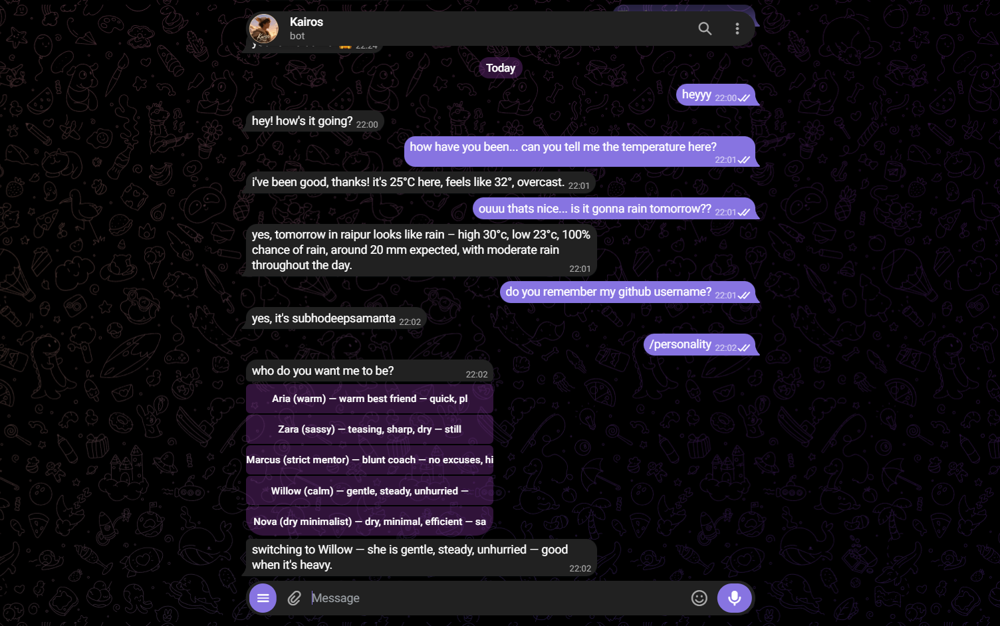
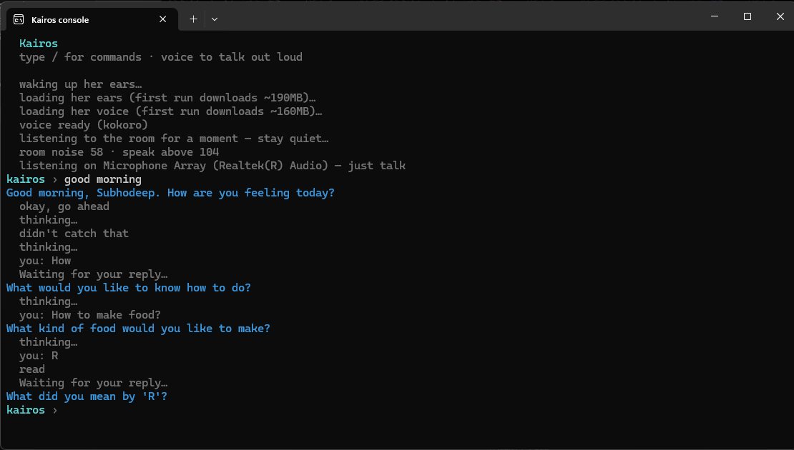
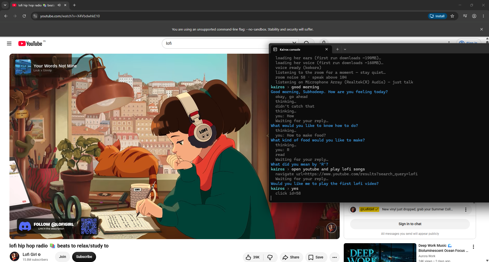
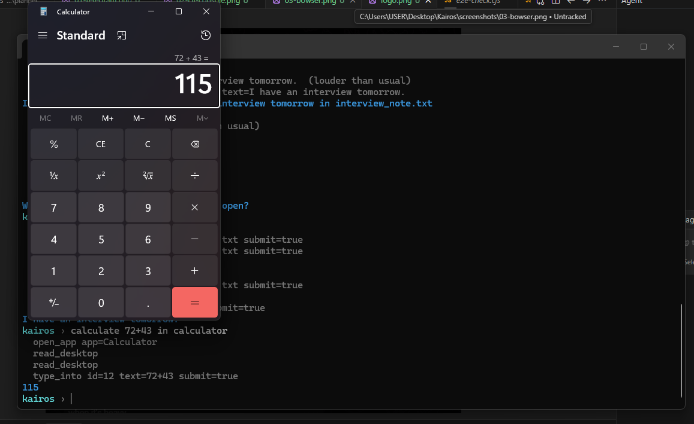
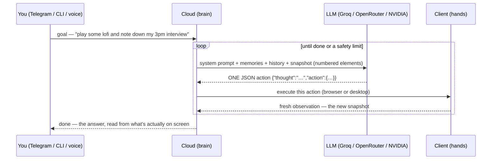
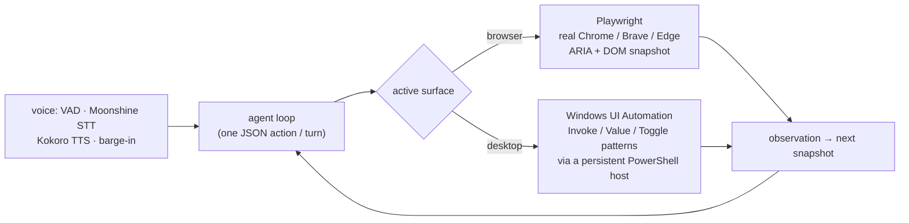

<div align="center">


# Kairos

**A personal assistant that drives your *real* computer — the browser, native Windows apps, and its own voice.**

You talk to it from Telegram, a terminal, or out loud. It looks at what is actually on the screen, decides one step at a time, and does it — searches the web, opens sites, fills forms, works inside Notepad or the Calculator, plays music, reads pages and answers back. It remembers you between sessions, and your passwords never leave your machine.

[](https://kairosbysubhodeep.vercel.app)
[](#-requirements)
[](#-testing)
[](#-what-it-can-do)
[](#-memory--secrets--deliberately-split)
[](LICENSE)
[](#-contributing)

**[🌐 Website](https://kairosbysubhodeep.vercel.app)** · **[🧠 How it works](#-how-it-works)** · **[⚡ Quick start](#-quick-start)** · **[📸 Screenshots](#-screenshots)**

</div>

---

## ✨ The idea

> **The model reasons. The code only acts.** Every turn, Kairos hands the language model a fresh, numbered snapshot of whatever surface it is on — a web page, a native window — and the model replies with exactly **one** JSON action. No regex classifiers, no heuristic "is this the login button" guessing. If it ever picks wrong, the fix is the prompt or the snapshot, never a special-case rule. This is the same design as OpenAI's Operator and browser-use, built from scratch and extended past the browser onto the Windows desktop and into voice.

Kairos is **two small Node programs**, split on purpose:

|  | 🧠 **Cloud** — the brain | 🖐️ **Client** — the hands |
|---|---|---|
| Runs | on a server (Render) *or* your laptop | only on your laptop |
| Owns | the LLM loop, memory, web search, scheduling | the browser, native apps, the microphone, your **passwords** |
| Sees | `{{secret:name}}` placeholders — never the real value | the real secrets, substituted at the last moment |
| Talks to | Telegram / CLI in, one WebSocket to the client | one WebSocket back to the cloud |

The brain can be hosted and shared; the hands — and everything sensitive — stay on your machine.

## 🎯 What it can do

- **Drives your real browser** — your actual Chrome / Brave / Edge profile, logged in as you, with human-like mouse, typing and think-time. Or a private "Kairos" window that keeps its own logins, or a throwaway Chromium for anonymous work.
- **Controls native Windows apps** — opens Notepad and types a note, does maths in the Calculator and reads the answer *off the screen*, plays music, logs into desktop apps — through the accessibility tree and UI Automation control patterns, not blind screen coordinates.
- **Talks and listens** — a full local voice stack: wake word, room-noise calibration, real-time transcription (Moonshine), natural speech (Kokoro), barge-in so you can cut it off mid-sentence.
- **Remembers you** — usernames, resolved site URLs, tastes and preferences persist across sessions; a chosen personality; an optional read on your mood.
- **Knows things without a browser** — web search and page-fetch answer questions in one cheap round-trip instead of opening tabs.
- **Reads your files** — a sandboxed workspace folder, images read via OCR.
- **Does things later** — `/remind 8:30am check the news`, `/remind daily 9am what's on today`.
- **Asks before it's irreversible** — a deterministic safety gate pauses before spending money, deleting, sending, or submitting a stored password.
- **Fails honestly** — every run reports what actually happened; a running-commit line and `/status` make "is it really working" answerable in one screen.

## 📸 Screenshots

<div align="center">

| | |
|---|---|
|  |  |
| *Chatting from Telegram — it remembers you* | *The terminal console, narrating each step* |
|  |  |
| *Driving the real browser, logged in as you* | *Working inside a native app via UI Automation* |

</div>

## 🚀 Quick start

### Requirements
- **Node.js 18+** (developed on 22) — `node --version`
- One **free LLM API key** — [Groq](https://console.groq.com/keys) is recommended (fast, free)
- **Windows** for the native-app control; the browser and voice work anywhere
- Optional: Chrome / Brave / Edge (falls back to a bundled Chromium), a Telegram bot token, a Postgres database

### Setup
```bash
git clone <this-repo> kairos && cd kairos

# install the two halves separately
cd cloud  && npm install && cd ..
cd client && npm install && cd ..

# the browser the client falls back to
cd client && npx playwright install chromium && cd ..

# config from the templates
cp cloud/.env.example  cloud/.env
cp client/.env.example client/.env
```

Open **`cloud/.env`** and paste in at least one key (`GROQ_API_KEY=...`). Pick any long random string for `CLIENT_SECRET` and put the **same** value in **`client/.env`**. That is the minimum — everything else is optional.

> On first run each half prints a **preflight report**. If something required is missing it tells you exactly what and how to fix it, instead of crashing with a stack trace.

### Run it — two terminals
```bash
# terminal 1 — the brain
cd cloud && node index.js

# terminal 2 — the hands
cd client && node index.js
# then type:  startKairos      (opens the console you talk to)
# or:         voice            (talk to it out loud)
```

Telegram works the moment the cloud is up — just message your bot.

## 🧠 How it works

### The agent loop — one honest step at a time



The model always acts on the **current** snapshot. After every state-changing action the surface is re-read, so element ids can never go stale. There is no code that reasons about the page — that is the whole point, and the reason a previous heuristic-driven version was torn out.

### One loop, three surfaces



The browser is driven through Playwright against the accessibility tree; native apps through **UI Automation control patterns** (`InvokePattern`, `ValuePattern`, `TogglePattern`…) spoken to over a long-lived PowerShell host — never screen coordinates, so it survives window moves and DPI changes. A small remap lets a stray browser-style action retarget cleanly once the desktop is the active surface.

### Safety, without letting the model judge safety

The consequence gate is **deterministic code, not model judgement** — the same principle as the crisis gate. It keys off *action type + the element's accessible label* (a `click` whose label matches a short, auditable verb list, or a `submit` carrying a `{{secret:…}}` placeholder), and never interprets page prose. Navigating, reading, scrolling and searching are never interrupted. `DRY_RUN=true` goes further — it plans and explores but refuses every click, type and keypress, narrating what it *would* do.

## 📊 By the numbers

| | |
|---|---|
| Automated tests (cloud **314** · client **383**) | **697** |
| Source files across the two packages | **124** (cloud 33 · client 91) |
| Surfaces one loop drives | **3** — browser, Windows desktop, voice |
| LLM providers, tried in order with failover | Groq → OpenRouter → NVIDIA (all free tiers) |
| Passwords or tokens the cloud/LLM ever sees | **0** — only `{{secret:name}}` placeholders |
| Voice models, chosen by benchmark on the laptop | Moonshine-base (STT) · Kokoro-82M fp16 (TTS) |
| Per-goal safety limits | 30 steps · 45 LLM calls · same action 4× → abort |
| Provider pacing | sliding-window tokens-per-minute limiter + per-model cooldowns |

## 🗂 Layout

```
cloud/            the brain — deployable to Render, or run locally
├── src/agent/        the LLM loop, system prompt, snapshot, safety gate, web tools
├── src/llm/          provider failover chain + rate pacing
├── src/memory/       facts — Postgres with atomic-JSON fallback + sync queue
├── src/companion/    personality, mood, crisis gate, episodic digest
├── src/schedule/     reminders (/remind, /scheduled)
├── src/connectors/   Telegram + CLI in, answers out
└── src/websocket/    protocol v2 — the one socket to the client

client/           the hands — only ever on your laptop
├── src/automation/browser/   Playwright, real profiles, human-like timing
├── src/automation/desktop/    Windows UI Automation via a PowerShell host
├── src/voice/                 VAD, wake word, Moonshine STT, Kokoro TTS, barge-in
├── src/secrets/               the local password vault ({{secret:name}})
├── src/files/                 sandboxed workspace, image OCR
└── src/executor/              one action → one observation

docs/             architecture · desktop-automation · companion · operations · roadmap
screenshots/      images used by this README
```

## ⚙️ Configuration

**`cloud/.env`**

| Key | Required | Purpose |
|---|---|---|
| `PORT` | no (default 3000) | WebSocket port; the client's `CLOUD_URL` points here |
| `CLIENT_SECRET` | recommended | Shared auth; must match the client |
| `GROQ_API_KEY` | **one LLM key** | Primary LLM — free at console.groq.com/keys |
| `OPENROUTER_API_KEY` | ↑ or this | Fallback LLM |
| `NVIDIA_API_KEY` | optional | Extra fallback |
| `TELEGRAM_BOT_TOKEN` | optional | Telegram connector (from @BotFather) |
| `DATABASE_URL` | optional | Postgres; omit → local JSON under `cloud/data/` |
| `CONFIRM_RISKY` | optional | `false` disables the safety gate |
| `DRY_RUN` | optional | `true` refuses every state-changing action |

**`client/.env`**

| Key | Required | Purpose |
|---|---|---|
| `CLOUD_URL` | yes | e.g. `ws://localhost:3000` |
| `CLIENT_SECRET` | recommended | Must match the cloud |
| `DEFAULT_BROWSER` | optional | `chrome` \| `brave` \| `edge` |
| `HUMANIZE` | optional | `false` disables human-like delays |
| `KAIROS_WORKSPACE` | optional | Move the sandboxed files folder |

## 🔐 Memory & secrets — deliberately split

| | Where | Why |
|---|---|---|
| Facts (usernames, resolved URLs, preferences) | Postgres `kairos_facts`, mirrored to `cloud/data/memory.json` | must survive restarts; safe to send to the LLM |
| Passwords / tokens | `client/data/secrets.json` — **your laptop only** | the cloud and LLM only ever see `{{secret:name}}`; the client substitutes at typing time |

Every JSON file is written atomically (tmp + rename, so a crash can't corrupt it); any Postgres write that fails while the DB is down goes to a retry queue that replays later — the local file is always the complete copy. Both `data/` directories and both `.env` files are gitignored. **Never commit real keys.**

## 🧑‍🤝‍🧑 Companion

Kairos has a personality and remembers you. In chat:

| Command | Does |
|---|---|
| `/personality [name]` | switch how it talks (aria, sassy, mentor, calm, nova) |
| `/mood [on\|off\|clear]` | see or control the mood read |
| `/memory` · `/recent` · `/about` | what it remembers · what you did recently · who it thinks you are |
| `/remind` · `/scheduled` · `/unschedule` | schedule a goal, list them, cancel one |
| `/status` · `/last` | is it actually working · replay the last goal's steps |
| `/forget <key\|chat\|moods\|all>` | make it forget something |

If you express distress, a hard-coded crisis gate replaces the assistant with real helpline information — see [`docs/companion.md`](docs/companion.md).

## 🧪 Testing

```bash
cd cloud  && npx vitest run     # 314 tests
cd client && npx vitest run     # 383 tests
```

**697 tests.** Browser tests run against a **simulated page** (no real Chromium — fast and deterministic); the desktop tests assert the PowerShell UI-Automation host stays syntactically valid and forces the right window to the foreground before it types; the protocol tests survive a client that disconnects and reconnects mid-step. The system prompt is pinned by an eval that must clear a 90% gate before any behavioural change ships.

## 🗺 Roadmap

- [ ] macOS desktop control (AXUIElement) and Linux (AT-SPI) — the browser and voice already run cross-platform
- [ ] A shipped web console alongside Telegram and the CLI
- [ ] Verified end-to-end account flows (Spotify login, wrong-password handling) promoted from "works" to "demo"
- [ ] Screenshot-grounded vision as a first-class surface, not just an OCR fallback
- [ ] Multi-step plan memory that survives across goals

## 🤝 Contributing

PRs are welcome. The codebase is deliberately small and every layer is readable in one sitting — start with [`cloud/src/agent/loop/agentLoop.js`](cloud/src/agent/loop/agentLoop.js) (the loop) and [`cloud/src/agent/prompt.js`](cloud/src/agent/prompt.js) (the system prompt — the main lever on behaviour), run `npx vitest run` in both halves, and open an issue or PR. Working agreement #1: **if the agent picks wrong, fix the prompt or the snapshot, never add a regex.**

## 📄 License

[ISC](LICENSE) © Subhodeep Samanta
