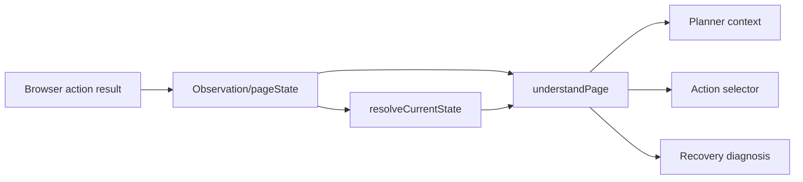
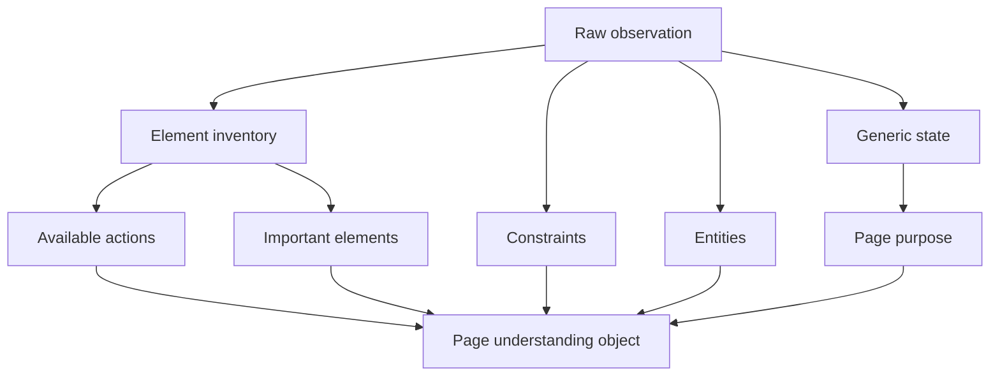
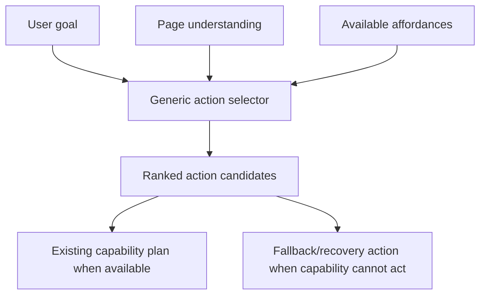
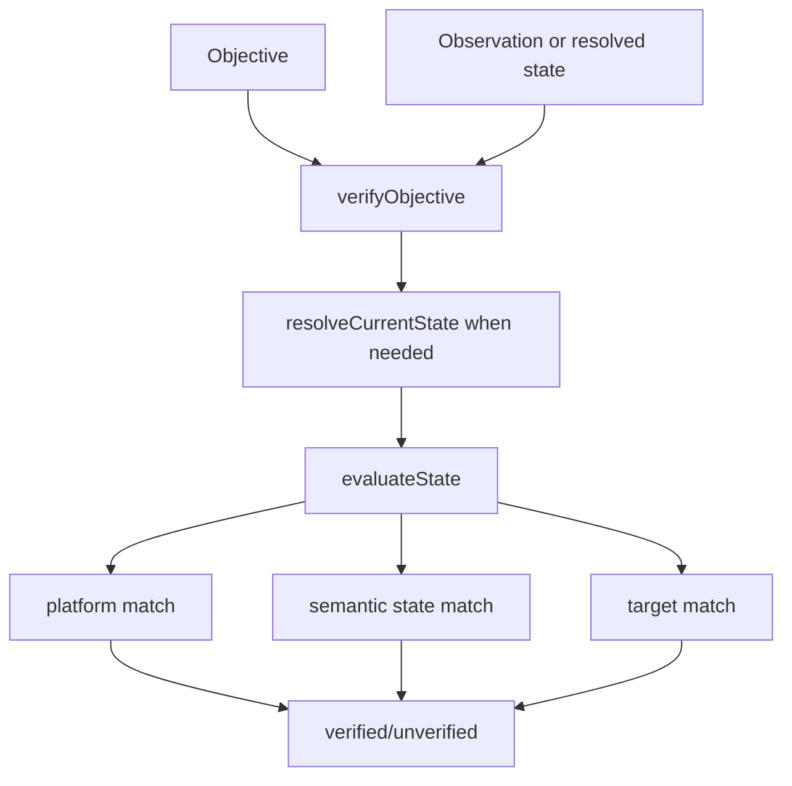
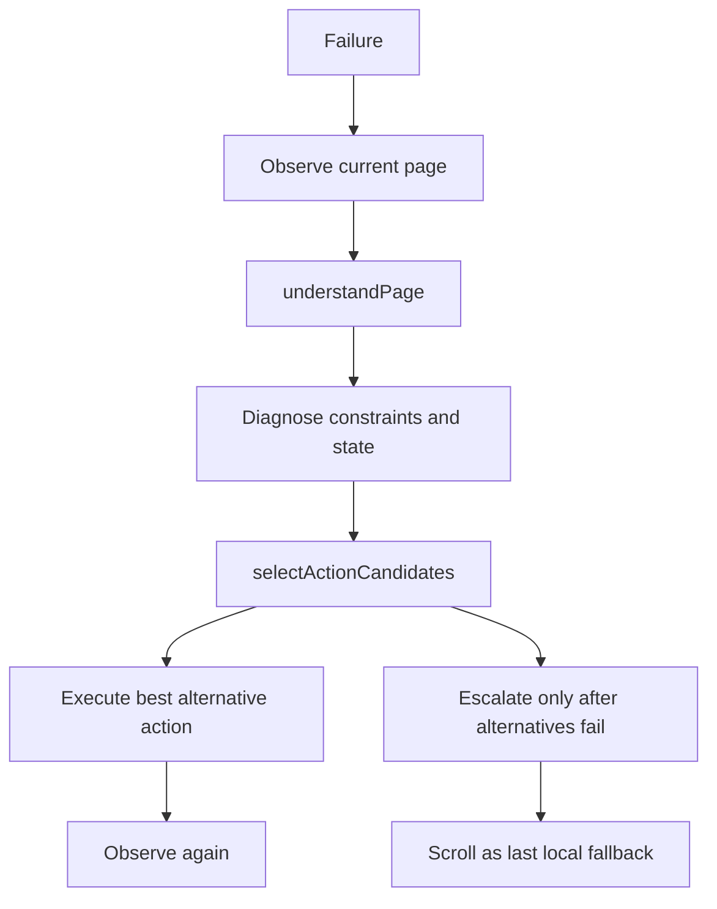

# Phase 3 Browser Operator Refactor

This phase keeps the state machine, transitions, and existing capability router. The change is to add generic page understanding and action selection around the current loop, then make objective verification the single authority.

## Observation Flow



## Page Understanding Flow



Output shape:

```js
{
  pagePurpose,
  pageSummary,
  availableActions,
  importantElements,
  entities,
  constraints
}
```

## Action Selection Flow



The selector does not know about individual websites or content categories. It scores generic affordances such as typing into inputs, clicking visible controls, refreshing observation, going back, and scrolling.

## Verification Flow



## Verification Consolidation

Authoritative path:

- `cloud/src/verification/objectiveVerifier.js`
- Main agent loop transition verification now uses `verifyObjective(currentObj, latestObs)`.

What is being removed from authority:

- Capability-specific `verify()` results are no longer the main transition success decision in the agent loop.
- `stateVerifier.js`, `stateMatchers.js`, and `unifiedVerifier.js` remain as compatibility modules, but should not be used for Browser Operator objective completion.

What remains:

- Existing capability `verify()` methods remain for backward compatibility and diagnostics.
- State machine and transition generation remain intact.
- Existing capability execution remains intact.

Migration plan:

1. Keep compatibility verifiers exported while all runtime completion checks move to `verifyObjective`.
2. Convert capability `verify()` methods into diagnostic helpers or remove them after no callers depend on them.
3. Replace `stateVerifier`/`stateMatchers` callers with `verifyObjective` or an objective-shaped adapter.
4. Add regression tests around `verifyObjective` for home, results, content, login, settings, extraction, and cross-platform mismatch.

## Recovery Flow



Recovery now prioritizes fresh observation, diagnosis, and an alternative generic action. Scrolling remains available, but only after better page-grounded alternatives are exhausted.
