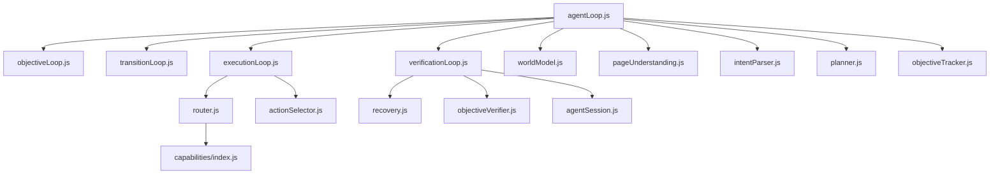
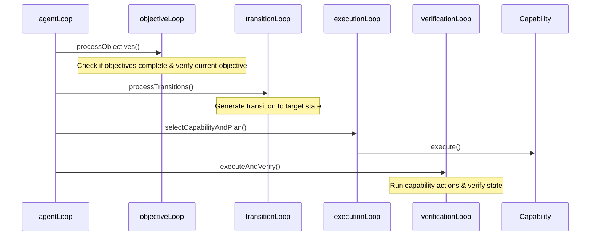

# Architecture Audit — Kairos Browser Agent

## 1. Current Dependency Graph

## 2. Current Execution Graph

## 3. Current Planner Flow
1. **parseIntent**: Parses user goal into intent type and platform.
2. **planObjectives**: Decomposes the intent into a series of transition state-machine objectives (e.g. `reach_entry_point` -> `locate_target` -> `interact_with_target`).

## 4. Current Verification Flow
- **verifyObjective**: Runs local matcher rule logic based on desired state and URL, falling back to LLM-based verification.
- Sites/capabilities specify URL patterns (e.g. checking `/watch` for YouTube video pages).

## 5. Current Recovery Flow
- **determineRecovery**: Runs when verification fails.
- Evaluates transition retries. If count is high, escalates (e.g., changes capability, replans transitions, or requests human intervention).

## 6. Hardcoding Inventory
- **Site-Specific Matches**: `youtube` / `/watch` checks in `MediaCapability.js` and `eventMatchers.js`.
- **Closed Intent Enum**: `goalParser.js` hardcodes sites (github, youtube, etc.) and intents (media, auth).
- **Environment Mapping**: `currentStateResolver.js` maps platforms to specific environment types.

## 7. Technical Debt Inventory
- **Dual Capability Models**: Primitive executors (`ClickExecutor`, etc.) in `capabilities/index.js` conflict with semantic capabilities (`SearchCapability`, etc.) in folders.
- **State-Transition Machine Overhead**: Planner constructs a sequence of transitions which capability logic must decrypt back into click/type actions.
- **Misaligned Page Types**: Website-specific designations (e.g., `repository_listing`, `video_player_page`) bias routing.
